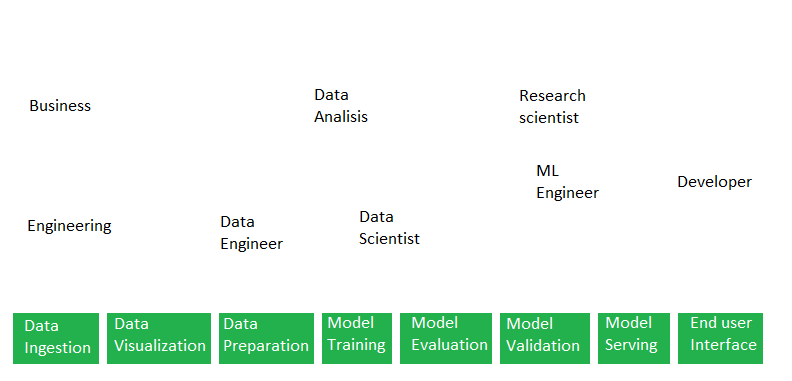
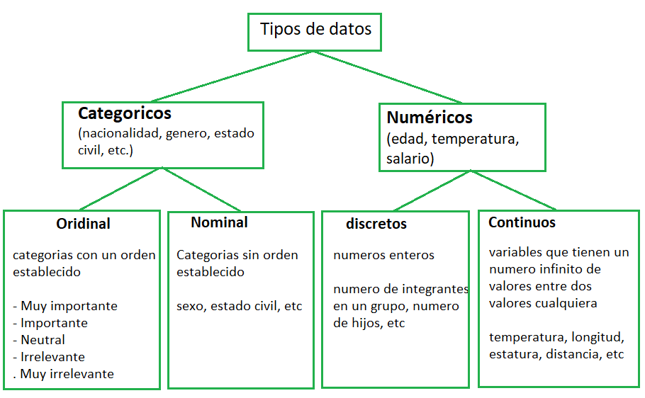
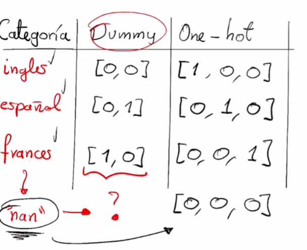

# Estadistica para ciencias de datos

## Que es estadistica? 

## Por que aprender estadistica
- Resumir grandes cantidades de informacion con valores representativos
- Tomar decisiones informadas
- Responder preguntas basada en evidencia 
- Reconocer patrones en los datos 

### Estadistica descriptiva
La estadística descriptiva es una disciplina que se encarga de recoger, almacenar, ordenar, realizar tablas o gráficos y calcular parámetros básicos sobre el conjunto de datos
[mas info](https://economipedia.com/definiciones/estadistica-descriptiva.html)

### Estadistica inferencial
La siguiente es una definicion de las muchas que podemos encontrar:
La inferencia estadística es el conjunto de métodos que permiten inducir, a través de una muestra estadística, el comportamiento de una determinada población[...]
[mas info](https://economipedia.com/definiciones/inferencia-estadistica.html)

## Que hace un data scientist?

Este es el flujo de trabajo que existe en data science. Cada actividad va enfocada a un tipo de rol en especifico y en cada paso usamos, de una u otra forma, algunas herramientas estadisticas 

- Ingesta de datos y validacion: Como es facil suponer, todo inicia con la ingesta de datos. Necesitamos datos para nuestro estudio y al mismo tiempo validar que esos datos se adaptan a nuestras necesidades. Este es uno de los pasos mas importantes porque si nuestros datos de entrada son basura, no importa lo poderoso que sea nuestro modelo, al final nos dara basura. Trash in, trash out
  - Como primer paso, necesitamos identificar los tipos de datos que usaremos. Existen dos grandes tipos: datos categoricos y datos numericos:
  

- Preparacion y entrenamiento: Se hace un analisis exploratorio de los datos con estadistica descriptiva para entender si hay alguna relacion entre ellos

- Evaluacion del modelo: En esta parte evaluamos la efectividad de nuestro modelo. Se pueden usar varias herramientas estadisticas, relacionadas con la estadistica inferencial, como el [test de hipotesis](http://www.itchihuahua.edu.mx/academic/industrial/estadistica1/cap02.html).
  
## Medidas de tendencia central
[Las medidas de tendencia central](https://es.wikipedia.org/wiki/Medidas_de_tendencia_central) son medidas estadisticas que pretenden resumir, en un solo valor, a un conjunto de datos

Supongamos que tenemos un conjunto de datos D = [1, 2, 3, 4, 5]

### Media o promedio
La media es el valor obtenido de la suma de todos los valores en nuestro conjunto, dividida entre el total de datos en el conjunto

Para nuestro conjunto: 
Media = (1 + 2 + 3 + 4 + 5, 2) / (6) = 2
**Add python code here**

### Mediana
La mediana es un valor que deja por debajo de si a la mitad de los datos, una vez que estan ordenados de menor a mayor

Para nuestro conjunto:
[1, 2, **2, 3**, 4, 5]
**Add python code here**

Si, como en este caso, hay dos valores que se encuentran en el medio (2 y 3), podemos calcular el punto medio entre ellos para encontrar la mediana

Mediana = 2.5, dejando 2 numeros a la izquiera y 2 numeros a la derecha

### Moda
La moda es el valor que mas se repite en nuestro conjunto:
En nuestro ejemplo la moda es 2, que se repite 2 veces
**Add python code here**

## Medidas de dispersion
### rango

### Rango intercuartil
rango entre Q1 y Q3 (cuartiles)

### Desiviacion estandar
# Nota al final:
"Con frecuencia cosntruimos un caso estadistico con datos imperfectos, como resultado hay numerosas razones por las cuales individuos intelectuales respetables pueden no estar de acuerdo sobre los resultados estadisticos"

(Naked statistics, Charles Wheelan)

# Estadistica descriptiva visual
Seria genial tener un catalogo de visualizaciones ... espera!
https://datavizproject.com/ - catalogo de visualizaciones

# Pipeline
## Escalamiento (normalizar)
- [preprocessing data](https://scikit-learn.org/stable/modules/preprocessing.html)
- [deepnote class](https://deepnote.com/project/curso-estadistica-descriptiva-2021-P1aZSOmoRU-PTaJ6oWEKhw/%2Fplatzi-curso-estadistica-descriptiva-2021%2F%5Bclase-15%5DProcesamiento-datos-numericos.ipynb)

### Datos lineales (distribucion simetrica o gaussiana)
transformar la distribucion de los rangos originales a [-1, 1] para que el modelo pueda converger mas rapido. Normalmente todos lo modelos fueron creados para trabajar con datos normalizados 
#### metodos
- min-max
- clipping
- Z-score
- etc
### Datos no lineales (distribucion no gaussiana)
Se transforma a una distribucion gaussiana para poder aplicar cualquiera de los metodos anteriores. Como? aplicando un escalamiento no lineal, es decir una funcion que no sea lineal: logaritmica, sigmoides, polinomiales, etc
[map to a normal distribution](https://scikit-learn.org/stable/auto_examples/preprocessing/plot_map_data_to_normal.html)

# Variables categoricas
podemos transformar estas categorias a variables numericas
## mapeos numericos
- representacion dummy: Usar cuando sabemos los inputs del modelo no tienen relacion. Las categorias son independientes entre si
- mapeo one-hot: convertira las categorias en estados (0, 1) de una lista de arrays. permite incluir categorias que no estaban en el dataset original

# correlacion
Necesitamos saber si dos variables estan relacionadas para disminuir la cantidad de variables que le pasamos a nuestro modelo. Si dos variables estan relacionadas, tal vez no aporta mucha informacion adicional
se dice que dos variables estan relacionadas si una varia en la misma forma que la otra. El coeficiente de correlacion nos dice que tan relacionadas estan estas variables y va desde -1 a 1. Valores cercanos a 0 indican poca relacion.
Correlacion no necesariamente significa "causasacion" 
[libro estadistica](https://cims.nyu.edu/~cfgranda/pages/stuff/probability_stats_for_DS.pdf)
## Matrix de covarianza
